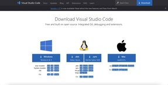
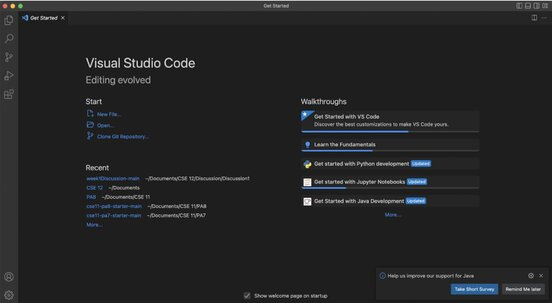
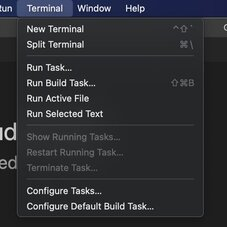
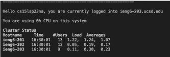
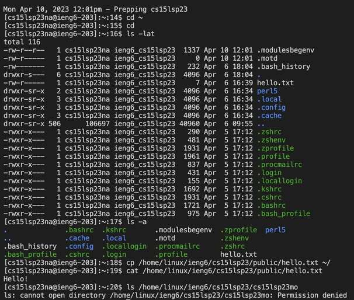

# Lab Report 1 

To log into a course specific account on ieng6 you would first need access to Visual Studio Code.

To install Visual Studio Code, you would need to go to the website [Visual Studio Code](https://code.visualstudio.com/). 
Once there you would need to click on the download button at the top right and select the download version that best suits your device.
The download page should look like this,



Once downloaded, find the downloaded file and open it. Click on the downloaded file to open up VScode. It should appear like this,


Once you have VScode opened, open the terminal by clicking on terminal in your menu bar and selecting new terminal


When you have your terminal open, make sure that you have git bash. This should not be a problem for mac but if you're on windows you would need to download it using this link to [github](https://gitforwindows.org/).

Now that you have VScode set up and your terminal open, type this command ``` ssh cs15lsp23zz@ieng6.ucsd.edu ```, into your terminal (without the quotation marks) but replace the zz in the command with the letters that a specific to your course-specific account. This command should follow the $ sign. The output should ask you for a password input. Enter your password and the output should look like this,



Once you see this, you have successfully remotely connected into a course-specific account on ieng6. Now that you have successfully remotely connected, you can start trying some commands in the terminal.

Some commands to try in the terminal are ``` cd~ ```, ``` cd ```, ``` ls -lat ```, ``` ls -a ```, ``` ls <directory> ```, ``` cp /home/linux/ieng6/cs15lsp23/public/hello.txt ~/ ```, ``` cat /home/linux/ieng6/cs15lsp23/public/hello.txt ```.
  
Here are some examples of the output of these commands,


Where ``` cd ``` allows you to move between directories. ``` cp ``` allows you to copy files and move them between locations. ``` ls ``` allows you to list the names of files and directories and provide the features of them. ``` cat ``` allows you to print the contents of a file into the terminal. As seen in the picture above, ``` ls -lat ``` allows us to see the total amount of disk blocks taken by the directory, ``` ls -a ``` allows us to see the names of the files in our working directory, ``` ls <diretory> ``` allows us to see the names of files and directories specific to someone's acount, ``` cp /home/linux/ieng6/cs15lsp23/public/hello.txt ~/ ``` allows us to copy the hello.txt file, and ``` cat /home/linux/ieng6/cs15lsp23/public/hello.txt ``` prints out the contents of the hello.txt file.

This is how you log into a course specific account on ieng6 and produce some results with command inputs in the terminal.
Good luck!
