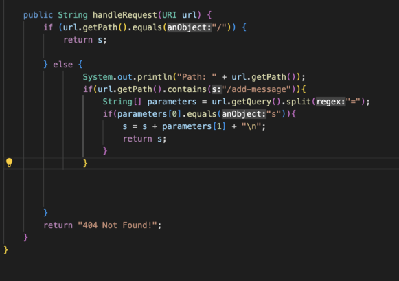
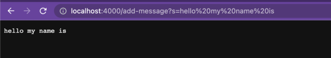
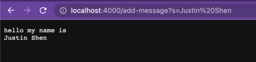
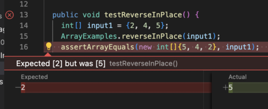
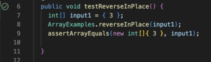

# Lab Report 2
# Part 1




In this example, the method handleRequest is called. The relavent field of the class is the field ``` s ```. The generic relavent arguments are ``` / ``` and ``` /add-message?s= ```. Specifically, the relavant argument to the method handleRequest is when I wrote ``` /add-message?s=hello my name is ``` into the url of the StringServer website that I created.  When I inputted this argument into the url, this called the method handleRequest and the value of the field s I created changed. The value of the relavent field ``` s ``` changed into the inputted value after the ``` = ``` in the argument plus a new line.



In this example, the method handleRequest is called. The relavent field of the class is the field ``` s ```. The generic relavent arguments are ``` / ``` and ``` /add-message?s= ```. Specifically, the relavant argument to the method handleRequest is when I wrote ``` /add-message?s=Justin Shen ``` into the url of the StringServer website that I created.  When I inputted this argument into the url, this called the method handleRequest and the value of the field s I created changed. The value of the relavent field ``` s ``` changed into the previous inputted value plus the current inputted value after the ``` = ``` in the argument plus a new line.

# Part 2

In ArrayExamples.java there were bugs in the reverseInPlace method. Specifically when I used a JUnit test with the values associated with input1, I got a failure.

```
public void testReverseInPlace() {
    int[] input1 = {2, 4, 5};
    ArrayExamples.reverseInPlace(input1);
    assertArrayEquals(new int[]{5, 4, 2}, input1);
}
```

However, here is a JUnit test that didn't induce a failure with the bugged code.

```
public void testReverseInPlace() {
    int[] input1 = { 3 };
    ArrayExamples.reverseInPlace(input1);
    assertArrayEquals(new int[]{ 3 }, input1);
}
```

This is the symptom of running the failure-inducing JUnit test.




This is the symptom of running the non failure-indcuing JUnit test.



Before changing the code, here is the bug-inducing code that caused the failure in one of the JUnit tests I used.
```
static void reverseInPlace(int[] arr) {
    for(int i = 0; i < arr.length; i += 1) {
      arr[i] = arr[arr.length - i - 1];
    }
}
```

After fixing the code, here is the non bug-inducing code that fixed the failures in the JUnit tests.
```
static void reverseInPlace(int[] arr) {
    for(int i = 0; i < arr.length; i++){
      int temp = arr[i];
      arr[i] = arr[arr.length-1-i];
      arr[arr.length-1-i] = temp;
    }
}
```

This fix addresses the issue because before, the reverseInPlace method was iterating through each index in the array and setting it to the value of the index opposite to the current index. This would produce a reverse array, however, the code is not accounting for when the for loop iterates through the latter half of the indexes, meaning the indexes after ``` arr.length/2 ```. This is a problem because once the for loop gets to the indexes beyond ``` arr.length/2 ``` it starts setting those indices to the values of the former half of the array, meaning that those indices are set to the values before ``` arr.length/2 ```. This is a problem because we already set the value of the former half of the array to the latter values of the array, and by setting the latter values of the array to now the former values of the array, we essentially get a duplicate value of the latter half of the array. To fix this problem, I wrote code that would temporarily place the values of the former half of the array and then later have the latter half of the array be set to those temporary values. This way the former half of the array would be set the latter half and the latter half would be set to the former half. This would create a reverse array of the original array.

# Part 3

Something that I learned in week 2 that I didn't know before was that you could use visual studio code to write code for a running webserver online. I also learned that you could run a webserver remotely on an ieng6 account with a specific port connected to it. In week 3 something I learned was how to use JUnit tests to test for cases in your code. I learned that you could use assertEquals to test for an expected result compared to an actual result.
