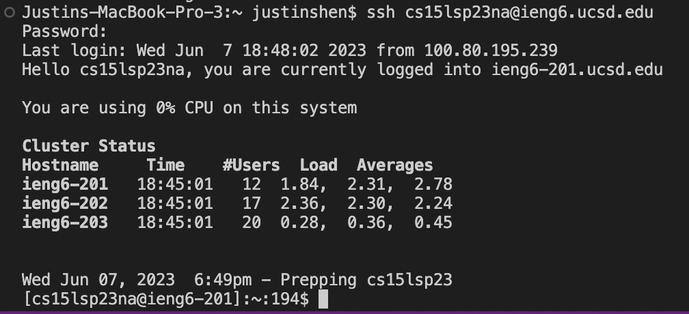
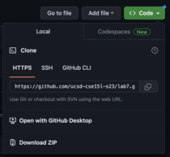
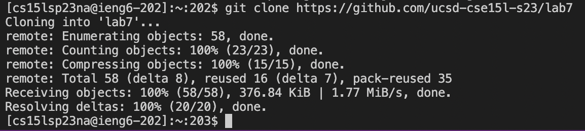
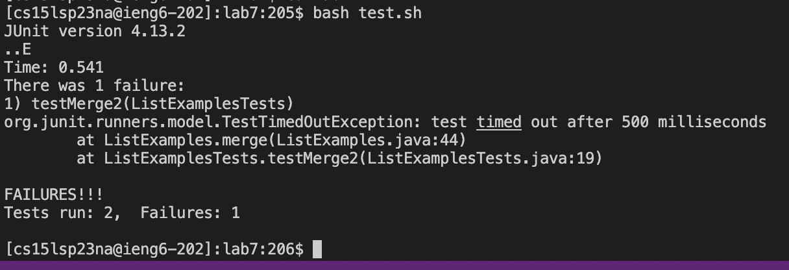
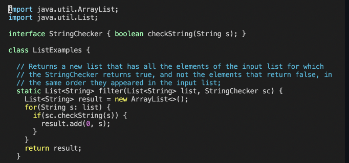
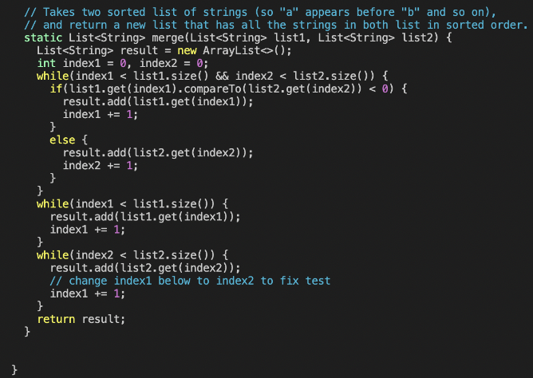
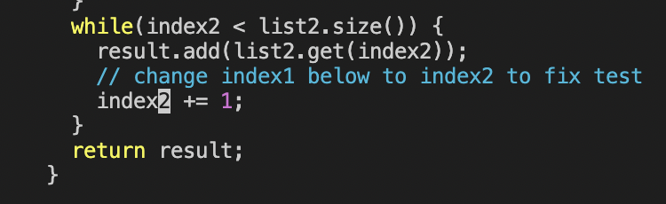
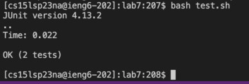
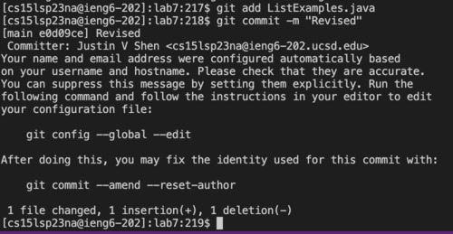

# Lab Report 4
## Step 4: Log into ieng6
The first step you want to do is to open a new window in Visual Studio Code. Then what you want to do is open up a new terminal. You can do this by typing in the keys ```<Ctrl+Shift+`>```. Then what you want to do is log into your ieng6 account. To do this, you type in the terminal ```ssh cs15lsp23zz@ieng6.ucsd.edu```, where ```zz``` is your account specific characters.



## Step 5: Clone your fork of the repository from your Github account
Now we need to clone your fork of the repository from your Github account. To do this, first, open up a web browser and go to the [Github](https://github.com/) website. After you log into your Github account, find the repository that you forked. After you have done that, click on the repository that you forked and search for the button that says ```<> Code```. When you click on this button, there should be a URL provided. Copy this URL by highlighting it and then using the copying hotkey ```<Ctrl-C>```.



After you have copied this URL, go back into Visual Studio Code and type ```git clone``` in your terminal and then use the pasting hotkey ```<Ctrl-V>``` to paste the URL you got from Github.



## Step 6: Run the tests, demonstrating that they fail
For this step, first, see if you are in the forked repository that you cloned. Type ```ls``` into the terminal. If you see that you are not already in your forked repository, type ```cd lab7``` into the terminal. Now, type ```bash test.sh``` into the terminal to run the tests. This will show that the tests have failed meaning that there are bugs within the code you have to change. 



## Step 7: Edit the code file to fix the failing test
Now, to edit the code file ```ListExamples.java```, type ```vim ListExamples.java``` into the terminal first. This is what it should look like after you have typed it.





Now we need to fix the bug within the code. To do this, type ```/1<Space><Enter><Shift-n>r2``` and then exit your code while saving it by typing in ```:wq<Enter>```. Now your code should be fixed. What we just did was found the index that was incremented wrong and changed the incrementation. In the ```/1<Space><Enter><Shift-n>r2``` command line we typed, the ```/``` command essentially allows us to search for certain key words, so after we type ```1<Space>```, what this does is it looks for every word in the file that has a 1 with a space coming after it. The ```<Enter>``` that comes after stops the search. The ```<Shift-n>``` looks for the key word that we had looked up from the bottom up, and then the ```r2``` will change the current cursor position to the number 2. Then the ```:wq<Enter>``` exits out of vim while saving the code. This should give us a change in the code that should look like the following where ```index1``` changes to ```index2```:



## Step 8: Run the tests, demonstrating that they now succeed
We need to see if the tests succeed now. To run the tests again, we can simply press the keys ```<up><up><Enter>``` because we previously already typed in the command to run our tests which was ```bash test.sh```. You could use this shortcut or just type in the command ```bash test.sh``` again into the terminal. Now we should see the tests succeed.



## Step 9: Commit and push the resulting change to your Github account
To commit and push the resulting change to your Github account, you need to first add the changes you've made. To do this you type ```git add ListExamples.java``` into the terminal. Then to commit, you would type ```git commit -m "Revised"``` into the terminal. The last thing we need to do is push it into your Github. To do this, you type ```git push``` into the terminal. What ```git add``` does is it adds the changes you've made in Git. What ```git commit -m``` does is it creates a new commit and the ```"Revised"``` part gives us a commit message that says "Revised" in Git. What ```git push``` does is it uploads all the local commits you have made in Git to Github. Once this is done, it should look like the following:


