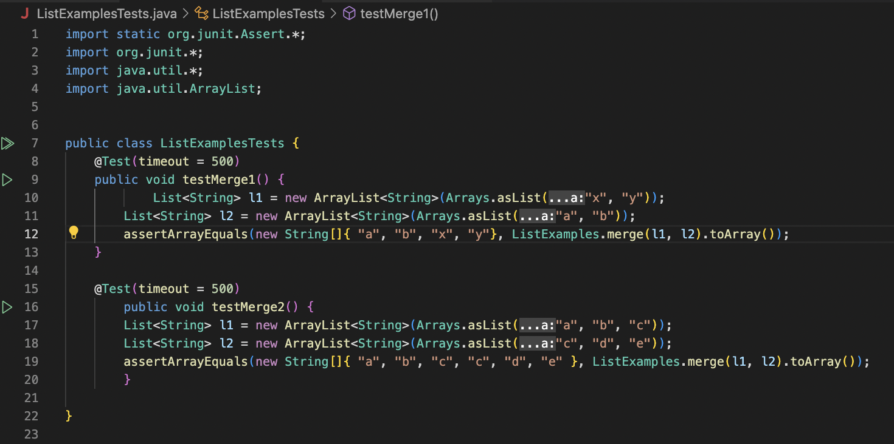

# Lab Report 3
## Part 1
### Edstem Posts

Student's question:


TA's response:


Student's response:


TA's response:


Student's response:


### Information about setup
- The file and directory structure needed for this setup was taken from week 7 lab. This included the JUnit files, ```ListExamples.java```, ```ListExamplesTests.java```, and ```test.sh```.
- The contents of each file before fixing bug are as follows:
  -  
  -  
  - 
- The full command line I ran to trigger the bug: 
  - ```bash test.sh <enter>```
- Description of what to edit:
  - First, I changed the JUnit run commands that were originally for Windows to Mac:
    - From ```javac -cp ".;lib/hamcrest-core-1.3.jar;lib/junit-4.13.2.jar" *.java```
    - and ```java -cp ".;lib/junit-4.13.2.jar;lib/hamcrest-core-1.3.jar" org.junit.runner.JUnitCore ListExamplesTests```
    - To ```javac -cp .:lib/hamcrest-core-1.3.jar:lib/junit-4.13.2.jar *.java```
    - and ```java -cp .:lib/hamcrest-core-1.3.jar:lib/junit-4.13.2.jar org.junit.runner.JUnitCore ListExamplesTests```
  - Then I changed the While loop incrementation and indexes ```List.Examples.java```:
    - I changed the first while loop: ```while(index2 < list1.size()) {``` to ```while(index1 < list1.size()) {```, with ```index2 += 1;``` changing to ```index1 += 1;```
    - I then changed the second while loop: ```while(index1 < list2.size()) {``` to ```while(index2 < list2.size()) {``` with ```index1 += 1;``` changing to ```index2 += 1;```
    - Both while loops appear as so now:
```
while(index1 < list1.size()) {
      result.add(list1.get(index1));
      index1 += 1;
}
while(index2 < list2.size()) {
      result.add(list2.get(index2));
      // change index1 below to index2 to fix test
      index2 += 1;
}
return result;
}
```
  

